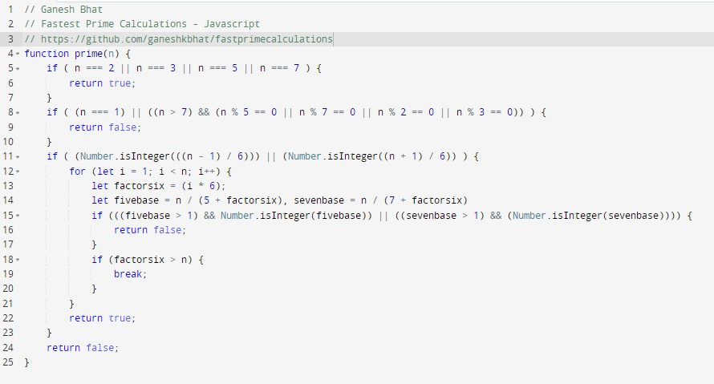
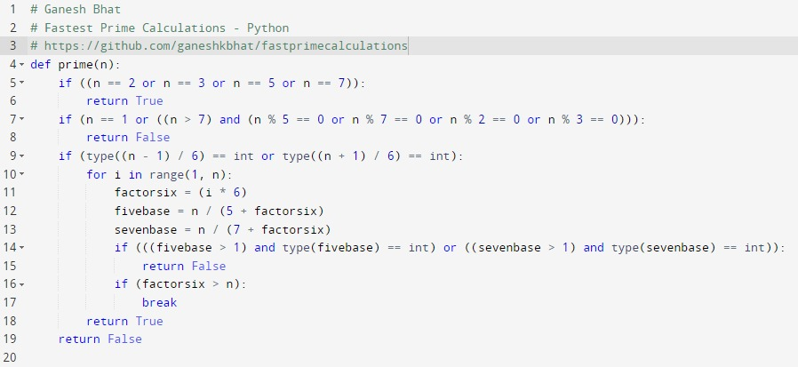

# Fast Prime Calculations

Fastest Prime Number Calculation (checks) logic and `This probably is the BEST solution in the internet as of today 11th March 2022`

This same code can be applied in any languages like `C`, `C++`, `Go` Lang, `Java`, `php`, `.NET`, `Python`, `Rust`, etc with the same logic and have performance benefits. It is pretty fast. I have not seen this implemented before and has been indigenously done. Feedback and usage is welcome.

`Max iterations 16666 for n == 100000 instead of 100000 of conventional way`. The `iterations` counts for different ways for Prime number check 100007 can be seen as follows:

    count: Prime (RECOMMENDED) Unconventional way 15
    Is Prime 100007:  false
    count: Prime Conventional way 96
    Is Prime 100007:  false
    count: Prime Squareroot way 96
    Is Prime 100007:  false
    

### Code Base 

##### Javascript

##### Python

Stack overflow Link for Calculations

- [Javascript Codebase](https://stackoverflow.com/questions/40200089/number-prime-test-in-javascript/71437628?noredirect=1#comment126271353_71437628)

- [Python Codebase](https://stackoverflow.com/questions/1801391/how-to-create-the-most-compact-mapping-n-%e2%86%92-isprimen-up-to-a-limit-n/71438297#71438297)

### LICENSE

`PROPRIETARY LICENSE AGREEMENT ONLY`
